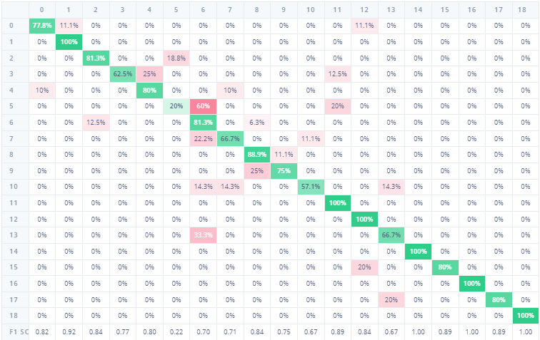
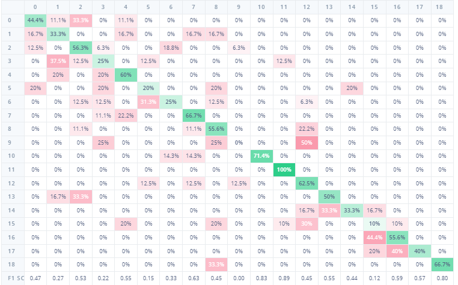
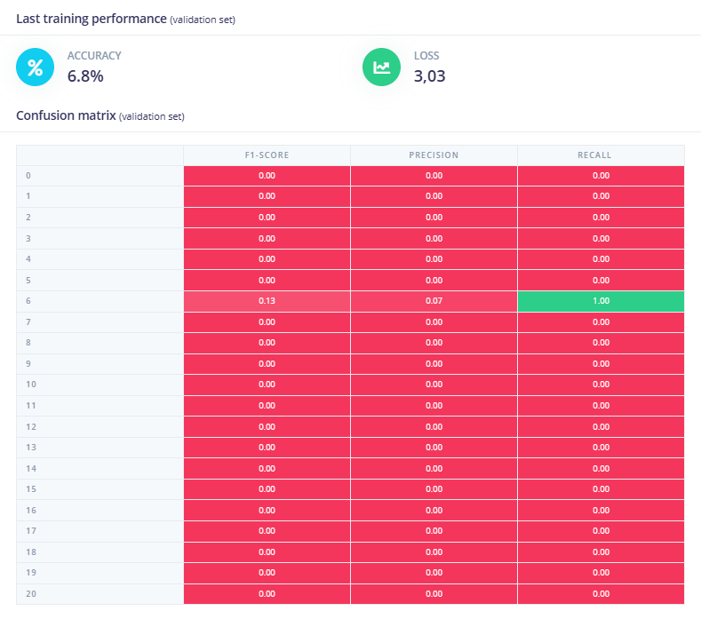
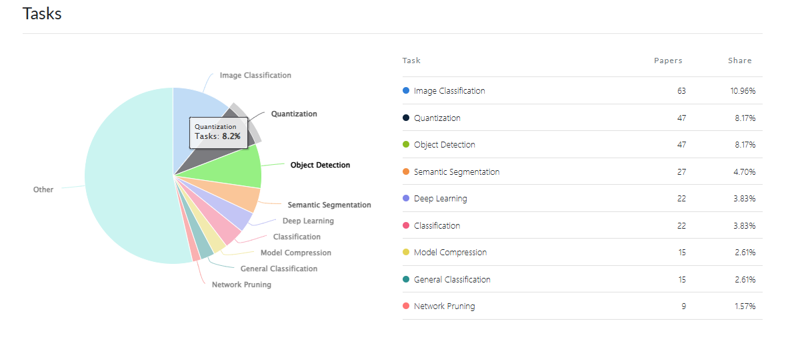

|   Method   |   Model   |    Training Acc  |  Test Acc | Flash| RAM|Inf |
|------------|-----------|------------------|-----------|------|----|----|
| Transfer   |MobileNetV2|      81.2%       |  78.22%   | 1.6M |893k|2ms |(final layer: 16 neurons, 0.1 dropout)
| Learning   |96x96 0.35 |                  |           |      |    |    |
|------------|-----------|------------------|-----------|------|----|----|
| Transfer   |MobileNetV1|      46.8%       |  10.16%   | 877k |300k|1ms |(no final dense layer, 0.1 dropout)
| Learning   |96x96 0.25 |                  |           |      |    |    |
|------------|-----------|------------------|-----------|------|----|----|
| Transfer   |EfficiNetB0|      65.6%       |  24.06%   | 15.4M|2.6M|18ms|
| Learning   |           |                  |           |      |    |    |
|------------|-----------|------------------|-----------|------|----|----|
| Classifica | Zie beschr|      80.5%       |  60.69%   | 1.4M |721k|2ms | (20 epochs)
|------------|-----------|------------------|-----------|------|----|----|
| Akida      | Zie beschr|      70.7%       |  62.22%   | 0    | /  | 1ms|
| Classifica |           |                  |           |      |    |    |
|------------|-----------|------------------|-----------|------|----|----|
| Akida      | Zie beschr|       6.8%       |  06.60%   | 0    | /  | 5ms|
| Transfer L |           |                  |           |      |    |    |
|------------|-----------|------------------|-----------|------|----|----|
| Regressie  | Zie beschr|    Loss 10 (mse) |  /        | 112k |700k| 2ms|
|            |           |                  |           |      |    |    |
|------------|-----------|------------------|-----------|------|----|----|

MobileNetV2 96x96 0.35 TL

MobileNetV1 96x96 0.25 TL

EfficiNetB0 TL

Classification

Akida classification

Akida TL

Regressie

FINAL CHOICE: 
Transfer learning MobileNetV2(96x96 0.35)

